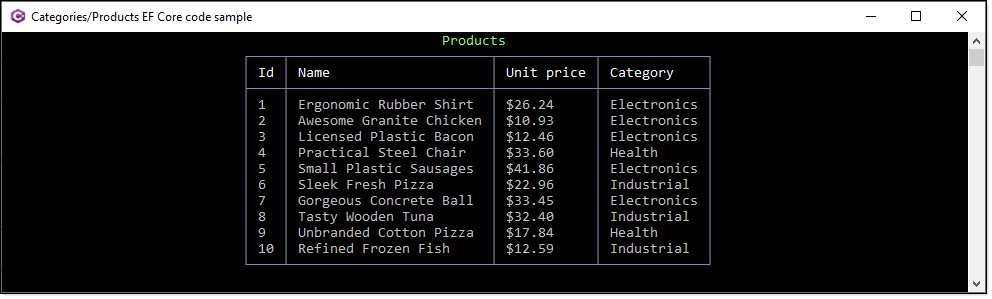

# About

Simple example using EF Core and Bogus

- `CategoriesProductsLibrary` class library is setup with EF Core with two models, categories and products
  - `BogusOperations` class contains code to generate mocked data with NuGet package Bogus.
  - `DataOperations` class reads data to the console
- This project
  - Uncomment `//await Initialize();` and run
  - Comment `//await Initialize();
  - Uncomment `//await ReadProducts();` and run

:small_blue_diamond: You can uncomment both but this will generate new data on each run.

:small_blue_diamond:   Open SSMS to `.\\SQLEXPRESS;Initial Catalog=BogusNorthWind` to view the database.

