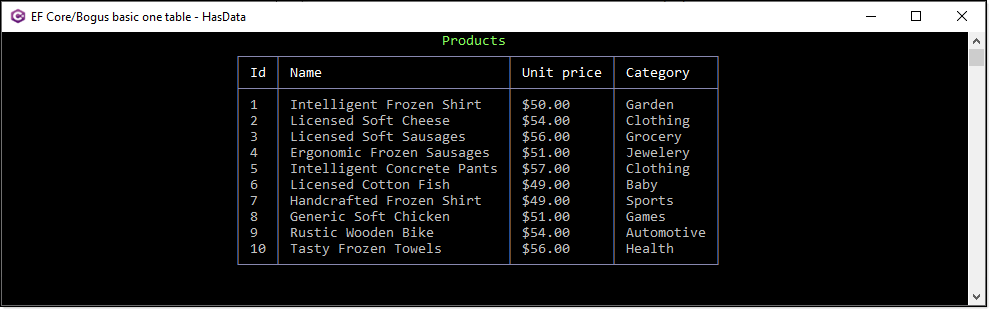

# Seed Entity Framework Core With Bogus Data

Shows how to create a database, one table and populate in the DbContext.

Please note in this case we have only one table unlike other examples which have parent child relations. This was done for readers to get a basic idea how to generate data with Bogus .

Taken from Khalid Abuhakmeh 

